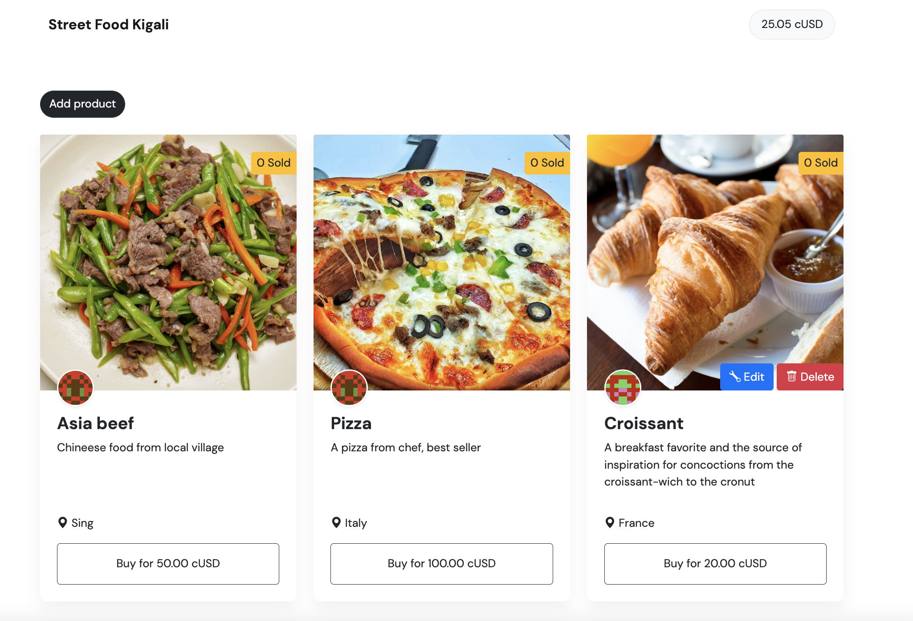

In previous chapters, you learn how to read, write, buy product in marketplace. But this is a marketplace where buyer and seller exchange goods, the buyer need to edit their product such as price, name, description, etc ... And if they dont want to sell this product, they may need to delete it right ? In this section, you will learn how to create edit & delete function into smart contract and implement it to frontend

## 4.1 Edit function

Open a `marketplace.sol` contract you already write in chapter 2. 
Create a function to let user edit a new value to their current product. Name it `editProduct`. You have to specific the type of parameters of the function.  
You need an index as a parameter to specific which product will edit. And, you also need to add _name, _image, _description, and _location. They are all a string stored in memory and the price is an uint.

The function use public method so that everyone can edit. But one thing important, only owner of product can edit their own product not everyone, so use `require` function to ensure that  ([Learn more about error handling](https://docs.soliditylang.org/en/latest/control-structures.html#error-handling-assert-require-revert-and-exceptions)).

This method prevent others user try to edit your product, it will display error message. Otherwise smartcontract excute edit function.

```solidity
    function editProduct(uint _index, 
        string memory _name,
        string memory _image,
        string memory _description, 
        string memory _location, 
        uint _price
        ) public {
        require(products[_index].owner == msg.sender, "You can not edit this product.");
        products[_index].name = _name;
        products[_index].image = _image;
        products[_index].description = _description;
        products[_index].location = _location;
        products[_index].price = _price;
    }
```

You're done with edit function. 

## 4.2 Delete funtion

Next create a function to let user delete their product. Name it `deleteProduct`. You only need to pass an index as a parameter to specific which product will delete.  ([Learn more about delete function](https://docs.soliditylang.org/en/v0.8.2/types.html?highlight=delete#delete)).

* Notes if you use `delete products`, it will reset all members inside, so in this case `delete products[_index]` will delete the value store at _index.

Like edit function, delete function use public method and use `require` function to ensure only owner of product can delete it not everyone. 

```solidity
    function deleteProduct(uint _index) public {
        require(products[_index].owner == msg.sender, "You can not delete this product.");
        delete products[_index];
    }
```

You're done with delete function. 

## 4.3 Implement to frontend

You will need to redeploy the marketplace.sol into celo blockchain and replace it with the new one you deploy. (You can watch it in in chapter 2). 
```
    const MPContractAddress = "0x564b27A5499fa3fcd4B763Ae4120282fa0eF6De2"
```
I already deploy it here: 
https://alfajores-blockscout.celo-testnet.org/address/0x564b27A5499fa3fcd4B763Ae4120282fa0eF6De2/transactions

In order to interact with your smart contract that is deployed in bytecode, you need an interface, you need to copy the new ABI (Application Binary Interface) and save it into `marketplace.abi.json` file of the contracts folder in your project.

In this scenario, you continue use bootstrap and old code from chapter 3.
First open `index.html`, below add new product modal, you need to edit a modal that opens up when the user clicks on the Edit product button. This code is pretty long.

```html
<!--Modal Edit-->
  <div
    class="modal fade"
    id="editModal"
    tabindex="-1"
    aria-labelledby="editProductModalLabel"
    aria-hidden="true"
  >
  <div class="modal-dialog">
    <div class="modal-content">
      <div class="modal-header">
        <h5 class="modal-title" id="editProductModalLabel">Edit Product</h5>
        <button
          type="button"
          class="btn-close"
          data-bs-dismiss="modal"
          aria-label="Close"
        ></button>
      </div>
      <div class="modal-body">
        <form>
          <div class="form-row">
            <div class="col">
              <input
                type="text"
                id="editProductName"
                class="form-control mb-2"
                placeholder="Enter name of product"
              />
            </div>
            <div class="col">
              <input
                type="text"
                id="editImgUrl"
                class="form-control mb-2"
                placeholder="Enter image url"
              />
            </div>
            <div class="col">
              <input
                type="text"
                id="editProductDescription"
                class="form-control mb-2"
                placeholder="Enter product description"
              />
            </div>
            <div class="col">
              <input
                type="text"
                id="editLocation"
                class="form-control mb-2"
                placeholder="Enter location"
              />
            </div>
            <div class="col">
              <input
                type="text"
                id="editPrice"
                class="form-control mb-2"
                placeholder="Enter price"
              />
            </div>
          </div>
        </form>
      </div>
      <div class="modal-footer">
        <button
          type="button"
          class="btn btn-light border"
          data-bs-dismiss="modal"
        >
          Close
        </button>
        <button
          type="button"
          class="btn btn-dark"
          data-bs-dismiss="modal"
          id="editProductBtn"
        >
          Edit product
        </button>
      </div>
    </div>
  </div>
  </div>
<!--/Modal Edit-->

```
### Display edit & delete button

Open the main.js file inside the src folder of your project. In function ```productTemplate```, create a variable ```configProduct```, this variable is the HTML of button edit & delete. It has condition to check only of owner product will display these button

```html
  let configProduct = ""
  if (kit.defaultAccount === _product.owner) {
        configProduct = `     
        <button class="btn btn-primary" 
            data-bs-toggle="modal"
            data-bs-target="#editModal"
            data-index="${_product.index}"
            data-name="${_product.name}"
            data-image="${_product.image}"
            data-description="${_product.description}"
            data-location="${_product.location}"
            data-price="${_product.price.shiftedBy(-ERC20_DECIMALS)}"
            id=${
            _product.index
        }>
            <i class="bi bi-wrench"></i> Edit
        </button>
        <button class="btn btn-danger delBtn" id=${
            _product.index
        }>
            <i class="bi bi-trash"></i> 
            Delete
        </button>
        `
  }
```

And modify the return ```productTemplate``` HTML

```html
return `
    <div class="card mb-4">
      <!-- Add edit & delete button -->
      <div style="position:relative">
        
        <div style="position:absolute;right:0;bottom:0;">
          `+ configProduct +`
        </div>
      </div>
      <!-- /Add edit & delete button -->
      <div class="position-absolute top-0 end-0 bg-warning mt-4 px-2 py-1 rounded-start">
        ${_product.sold} Sold
      </div>
      <div class="card-body text-left p-4 position-relative">
        <div class="translate-middle-y position-absolute top-0">
        ${identiconTemplate(_product.owner)}
        </div>
          <h2 class="card-title fs-4 fw-bold mt-2 flex-grow-1">${_product.name}</h2>
        <p class="card-text mb-4" style="min-height: 82px">
          ${_product.description}             
        </p>
        <p class="card-text mt-4">
          <i class="bi bi-geo-alt-fill"></i>
          <span>${_product.location}</span>
        </p>
        <div class="d-grid gap-2">
            <a class="btn btn-lg btn-outline-dark buyBtn fs-6 p-3" id=${
                _product.index
            }>
                Buy for ${_product.price.shiftedBy(-ERC20_DECIMALS).toFixed(2)} cUSD
            </a>
        </div>
      </div>
    </div>
    `
```

### Hide deleted products

Go to function `renderProducts` and add  

```javascript
    if (_product.owner == "0x0000000000000000000000000000000000000000") return
```

When use function `delete` in smartcontract, it will set to 0, you need a condition to check if owner is valid so it won't display the deleted product. The complete code will be like this: 

```javascript
function renderProducts() {
  document.getElementById("marketplace").innerHTML = ""
  products.forEach((_product) => {
    const newDiv = document.createElement("div")
    newDiv.className = "col-md-4"
    if (_product.owner == "0x0000000000000000000000000000000000000000") return
    newDiv.innerHTML = productTemplate(_product)
    document.getElementById("marketplace").appendChild(newDiv)
  })
}
```

### Call function editProduct

To interact with ```editProduct``` function you should open a modal edit box and adapt a edit button event. Move to button of file main.js, and add event listen when user click on edit button to open modal box.  

```javascript
document.getElementById('editModal').addEventListener('show.bs.modal', (e) => {
  document.getElementById('editProductName').value = e.relatedTarget.dataset.name
  document.getElementById('editImgUrl').value = e.relatedTarget.dataset.image
  document.getElementById('editProductDescription').value = e.relatedTarget.dataset.description
  document.getElementById('editLocation').value = e.relatedTarget.dataset.location
  document.getElementById('editPrice').value = e.relatedTarget.dataset.price
  document.getElementById('editProductBtn').setAttribute('data-index', e.relatedTarget.dataset.index)
});
```

When edit modal is display, user modify product and click submit button to interact with `editProduct` function, you should receive the product name and show them a notification about what is happening.

```javascript
document
  .querySelector("#editProductBtn")
  .addEventListener("click", async (e) => {
      const index = document.getElementById('editProductBtn').getAttribute('data-index')
      const name = document.getElementById("editProductName").value
      const imageUrl = document.getElementById("editImgUrl").value
      const description = document.getElementById("editProductDescription").value
      const location = document.getElementById("editLocation").value
      const price = new BigNumber(document.getElementById("editPrice").value)
                    .shiftedBy(ERC20_DECIMALS)
                    .toString()
    notification(`⌛ Edit "${name}"...`)
    try {
      const result = await contract.methods
        .editProduct(index, name, imageUrl, description, location, price)
        .send({ from: kit.defaultAccount })
    } catch (error) {
      notification(`⚠️ ${error}.`)
    }
    notification(`🎉 You successfully edit "${name}".`)
    getProducts()
  })
```

### Call function deleteProduct

Move to ```document.querySelector("#marketplace")``` add event delete, if user click on delete button, call to `deleteProduct` function. Then send them a notification and render the products again,

```javascript
 if (e.target.className.includes("delBtn")) {
    const index = e.target.id
    notification(`⌛ Waiting confirm delete..."${products[index].name}"...`)
    try {
      const result = await contract.methods
        .deleteProduct(index)
        .send({ from: kit.defaultAccount })
      notification(`🎉 You successfully delete "${products[index].name}".`)
      getProducts()
      getBalance()
    } catch (error) {
      notification(`⚠️ ${error}.`)
    }
  }
```

Finally, you should display all notifications. If there is no error, call your getProducts function again to show the updated products in your DApp, and yourgetBalance function to show the updated balance after the user bought the product.


